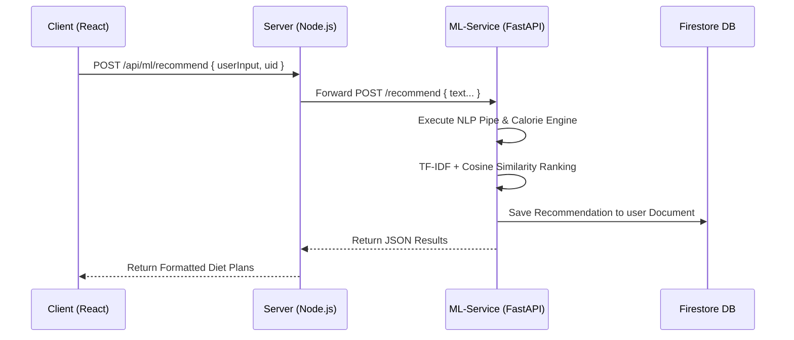

# FitFuel: Machine Learning Architecture & System Design

## 1. Executive Summary
The FitFuel recommendation engine operates as an independent, loosely-coupled Python microservice (`fitfuel-ml-service`). It is designed to interpret raw human-language inputs regarding dietary preferences and physical profiles, compute metabolic parameters based on scientific standards, and leverage vector similarity to recommend statistically optimal diet plans. 

This document serves as the technical whitepaper explaining the mathematical models, natural language pipelines, and data flow executed by the ML engine.

## 2. Microservice Architecture & Data Flow

The application achieves high cohesion through a designated API Gateway pattern, where the Node.js backend (`server/`) serves as a proxy to the isolated Python ML service.

1. **User Input:** Raw data is captured on the frontend dashboard.
2. **Reverse Proxy:** The Node.js Express server routes the request via `/api/ml/recommend` implicitly to the FastAPI service operating on port 8000.
3. **Execution:** Python parses the string, predicts the diet, searches its serialized `.pkl` artifact databases, and queries Firestore seamlessly via the `firebase-admin` SDK to persist historical records.
4. **Resolution:** The response is channeled straight back to the React UI for rendering.

---

## 3. Natural Language Processing (NLP) Pipeline

The entry point into the ML service handles unstructured user input. Rather than forcing users to use rigid dropdown menus, the NLP engine (`nlp/heuristic_extractor.py` and `nlp/intent_parser.py`) uses heuristic pattern matching and regex classification to deduce parameters.

### Extraction Heuristics
- **Weight/Height:** Looks for numeric proximities to `kg`, `lbs`, `cm`, `feet`. Converts sequentially to metric format.
- **Goals:** Detects latent intent vectors like `"lose weight"`, `"cut"`, or `"shred"` and classifies the global goal as `weight_loss`, `muscle_gain`, or `maintenance`.
- **Activity Level:** Scans for keywords like `"marathon"`, `"desk job"`, `"active"` to assign multipliers spanning from `1.2` (Sedentary) to `1.9` (Extra Active).
- **Dietary Restrictions:** Labels negative constraints like `"vegan"`, `"no gluten"`, or `"keto"` to filter candidate datasets later in the pipeline.

---

## 4. The Calorie & Macronutrient Engine ([calorie_engine.py](file:///d:/FitFuel/fitfuel-ml-service/models/calorie_engine.py))

If explicitly structured parameters aren't supplied, the system leans on its mathematically rigorous core to determine the user's Total Daily Energy Expenditure (TDEE).

### Baseline Calculation: Mifflin-St Jeor Equation
Considered the gold standard by the Academy of Nutrition and Dietetics, FitFuel utilizes Mifflin-St Jeor over Harris-Benedict for accuracy:
* **Men:** `BMR = (10 × weight_kg) + (6.25 × height_cm) - (5 × age) + 5`
* **Women:** `BMR = (10 × weight_kg) + (6.25 × height_cm) - (5 × age) - 161`

### Energy Multiplication & Goal Variance
The BMR is multiplied by the heuristic Activity Factor to derive the TDEE. Then, goal-based offsets are applied:
* `weight_loss`: TDEE - 500 kcal
* `muscle_gain`: TDEE + 300 kcal
* `maintenance`: +0 kcal

### Accurate Macronutrient Constraints (ISSN Standard)
Following the International Society of Sports Nutrition (ISSN), macronutrients dynamically pivot around total caloric intake rather than static bodyweight parameters:
1. **Protein:** Fixed safely at `1.8g / kg` of body weight to preserve/build lean mass.
2. **Fat:** Scaled dynamically to `25%` of the total target caloric intake (`target_cals * 0.25 / 9`).
3. **Carbohydrates:** Function as the algorithmic sink, filling the remaining void ([(target_cals - (protein * 4) - (fat * 9)) / 4](file:///d:/FitFuel/client/src/App.jsx#45-77)).

---

## 5. Machine Learning Recommendation (TF-IDF & Cosine Similarity)

The ranking engine (`models/diet_recommender.py`) relies on high-dimensional text vectorization to pair the user with optimal static diet plan templates stored natively.

### 5.1 Training Phase (Offline)
All known diet plans are passed through a `TfidfVectorizer`.
* **TF-IDF (Term Frequency-Inverse Document Frequency):** Emphasizes keywords unique to certain diets (e.g., "quinoa", "high-protein") while penalizing generic filler words.
* The algorithm fits the vocabulary across all diet descriptions and transforms them into a high-dimensional vector space, generating `tfidf_matrix.pkl` and `vectorizer.pkl`.

### 5.2 Inference Phase (Online Execution)
When a user requests a plan:
1. **Constraint Filtering:** The engine radically strips out any diet templates that violate the user's dietary restrictions extracted by the NLP module.
2. **Vector Querying:** The user's query ("high protein vegan diet for weight loss") is transformed using the loaded `vectorizer.pkl` into the same vector space.
3. **Cosine Similarity:** The engine calculates the cosine angle between the user's query vector and all valid candidate diet vectors in the TF-IDF matrix.
   * `Similarity(A, B) = (A · B) / (||A|| × ||B||)`
   * The closer the value is to `1.0`, the tighter the semantic alignment.
4. **Metabolic Penalty Scoring:** The top semantic matches are then penalized based on their absolute distance from the user's mathematically calculated Calorie/Macro targets to ensure the diets aren't just relevant in text, but metabolically precise.
5. **Final Output:** The top `K` results are zipped with confidence coefficients and returned to the Node proxy.
